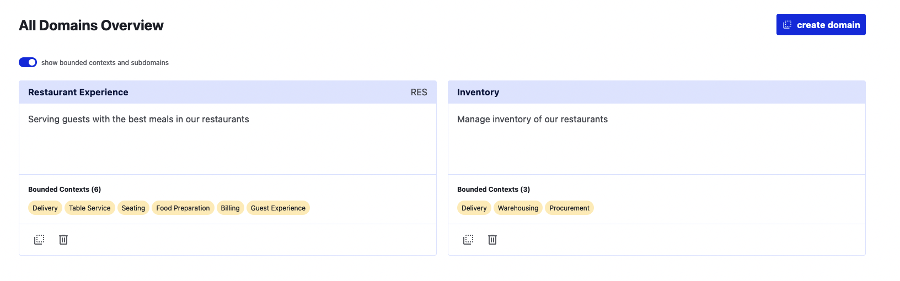
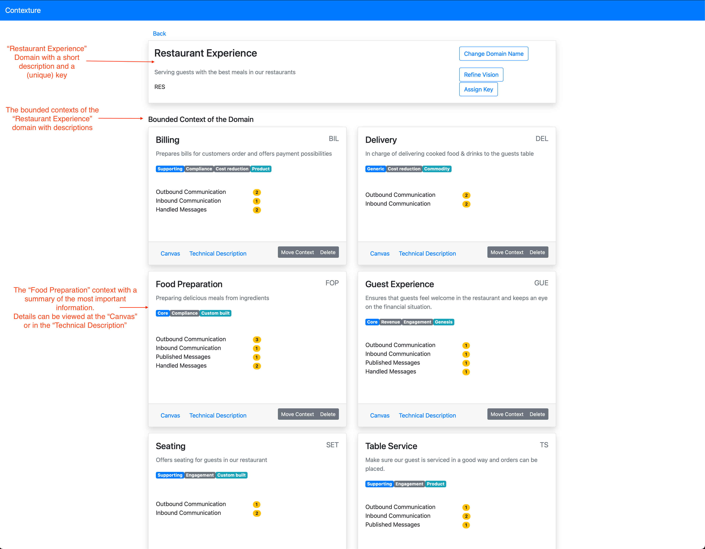
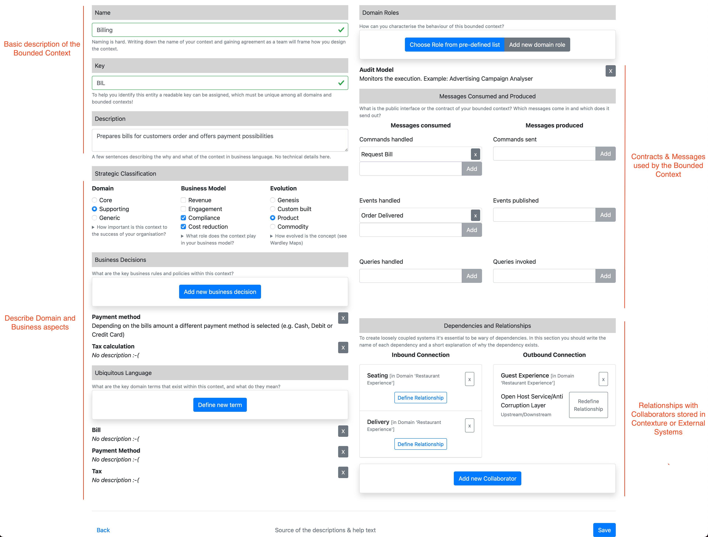

# Contexture - the Bounded Context Canvas Wizard

The Bounded-Context-Canvas (BCC) was introduced by [Nick Tune](https://medium.com/nick-tune-tech-strategy-blog/bounded-context-canvas-v2-simplifications-and-additions-229ed35f825f) as a tool to document and visualize contexts and their connections in a system.
The canvas can be used to certain document business aspects, the most important behaviors and interactions of a bounded context with other parts of the system.
Reading and understanding an existing canvas is simple, even for people who are not familiar with concepts from Domain Driven Design.
In order to create a new BCC, you need to understand a lot of concepts from DDD and filling in all the fields is not a simple task.

While other ways to build a [BCC exist](https://github.com/ddd-crew/bounded-context-canvas), we are building an application to support this modeling process with a dedicated tool developed with an DDD mindset.
You can read about the ideas of Contexture in the [concept](./concept.md) and you can view the current status of the application at <https://contexture.azurewebsites.net/> (be careful: don't store any sensitive data there; everything you store will be deleted upon the next deployment.)

Note:

We think that most of the domain modelling should happen in a collaborative way, by using whitepaper, Post-ITs or online collaboration tools.
Contexture is and will not be the right tool or a replacement for these interactive modelling sessions!
But Contexture might be useful to capture, document and structure some of the insights *after* a modelling session and make them accessible and shareable with other people!

## Example

Imagine you work with a company that owns a restaurant chain which cares about giving the guest a great experience.
The restaurants are equipped with different IT systems, which support the staff to execute their tasks.
The example can be seen at <https://contexture.azurewebsites.net/> and the following screenshots give a short summary / explanation

Domains of the example


An overview on the Bounded Contexts of the "Restaurant Experience" domain


A detailed view of the "Billing" Bounded Context with the help of the Bounded-Context-Canvas-v3


## Contexture backend

The Contexture server implements a simple storage backend that exposes a file system backed API and serves static assets through a Giraffe F# application.

### Run the backend

Contexture server will listen on port `5000` per default and use `data/db.json` as default database file.
If you want to have the server listening on any other port, set the environment variable `ASPNETCORE_URLS=http://*:8080` to the desired port.
To choose a different database file configure the `DatabasePath` configuration via an environment variable.
Note: you might need to exclude launch-profiles on start via `--no-launch-profile`.

```bash
cd backend
dotnet run --project Contexture.Api
```

### Publish and running the backend manually

```bash
cd backend
dotnet run --configuration Release Contexture.Api/Contexture.Api.fsproj --output artifacts
```

Run the published version of the backend:
```
cd artifacts
ASPNETCORE_URLS=http://*:8080 DATABASEPATH=data/mydb.json dotnet Contexture.Api.App.dll
```

### Caveats

- `cors` is configured to allow all origins
- no logging built in
- no UI for Namespace-template administration.
  Use the following `curl` commands to manage templates:
    - get templates

        curl http://localhost:5000/api/namespaces/templates

    - create a template

        curl -X POST \
            -H "Content-Type: application/json" \
            -d '{ "name":"barfoo", "description":"my awesome namespace", "labels": [ { "name": "first label", "description":"some description", "placeholder": "some placeholder value"}]}' \
            http://localhost:5000/api/namespaces/templates

    - add a label template to an existing namespace

        curl -X POST \
            -H "Content-Type: application/json" \
            -d '{ "name":"barfoo", "description":"some description", "placeholder": "some placeholder value"}' \
            http://localhost:5000/api/namespaces/templates/<template-id>

    - delete a label from a template

        curl -X DELETE http://localhost:5000/api/namespaces/templates/<template-id>/labels/<label-id>

    - delete a namespace

        curl -X DELETE http://localhost:5000/api/namespaces/templates/<template-id>

## Contexture frontend application

The application is developed with [Elm](https://elm-lang.org/) and connects to the backend via the API.

Make sure [Node](https://nodejs.org/en/) is installed and NPM is in your path.

### Run the frontend

```bash
cd frontend
npm install
npm start
```

Make sure the backend part is reachable with its default url <http://localhost:3000>

## Running with Docker

To build the Docker image use the `Makefile` via `make build-image` or execute the commands manually.

To run the `softwarepark/contexture` image use `make run-app` and browse to <http://localhost:3000>.

Your data will be stored in the `/data/db.json` file on the volume `/data`.

## Contributors

Thanks to all [existing and future contributors](https://github.com/Softwarepark/Contexture/graphs/contributors) and to the following individuals who have contributed with ideas, feedback or testing:

- [Nick Tune](https://github.com/NTCoding)
- Peter Rosner
