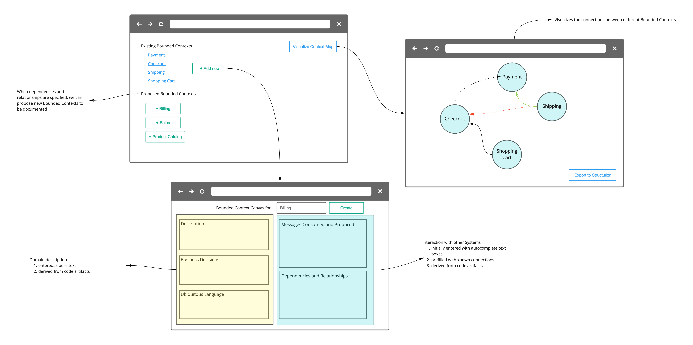

# Contexture - the Bounded Context Canvas Wizard

The Bounded-Context-Canvas (BCC) was introduced by [Nick Tune](https://medium.com/nick-tune-tech-strategy-blog/bounded-context-canvas-v2-simplifications-and-additions-229ed35f825f) as a tool to document and visualize contexts and their connections in a system.
The canvas can be used to document business aspects, the most important behaviors and the interactions of a bounded context with other parts of the system.
Reading and understanding an existing canvas is simple, even for people who are not familiar with concepts from Domain Driven Design.
In order to create a new BCC, you need to understand a lot of concepts from DDD and filling in all the fields is not a simple task.

## Building an application

Typically a BCC is created with the help of Post-ITs on physical paper, while digital versions are usually just a mirror of the physical representation, e.g. with the help of Miro.
Meaning that the captured information is represented as free text on virtual Post-ITs and is not stored in a structured way.
This prohibits further data processing and visualization of the information.

Therefor we propose to design a small application which:

- stores information about a BCC in a structured way instead of just using free text on (virtual) Post-ITs,
- allows explicit connections between different bounded contexts,
- supports updating and versioning of the information over time,
- allows to export and visualize the information from the application,
- and helps people to input data for a BCC easier



While capturing the data manually via a form is great for learning, understanding and building up initial representations of BCC.
The manual work can only be seen as a short to mid term goal, in the long run the data for the BCC should be gathered automatically from applications and should then be presented to the user.
E.g. the data can be read from the source code during the build process:

- capturing domain terminology by looking at frequently used words,
- reading business rules & policies from e.g. attributed types,
- discovering dependencies to other systems via e.g. OpenAPI documents or
- describing model traits or classifications via attributes

Additional ideas on how to gather or present information can be read in [Cyrille Martraire book on Living Documentation](https://leanpub.com/livingdocumentation).

### Features for a Prototype

:white_check_mark: MVP: "Mimicking the BCC with HTML forms"

- [x] Have a form mirroring the BCC with free text fields
- [x] Creating a new bounded context by submitting a new form
- [x] Loading existing BCC into a form and updating them by (re)submitting it

Version 1: "Improving data quality"

- Use dropdowns + (conditional) free text where appropriate (strategic classification, model traits, relationships)
- Improve definition of ubiquitous language terms (allow Key-Value pairs)
- Provide Auto-complete boxes (free text search) for dependencies (search in already existing BCC names)
- Provide Auto-complete boxes (free text search) for consumed message contracts (search in produces message contracts)
- [x] Include more help text and [tips](https://github.com/ddd-crew/bounded-context-canvas/blob/master/resources/model-traits-worksheet.md) 
- [ ] Include checkboxes and free text fields for 'Business Model' and 'Classification'

Note: can be run without any external dependencies

Version 2: "Connecting existing Tools for visualization"

- connect Structurizr as (additional?) persistence layer
- Visualize data from Structurizr as BCC
- evaluate [Context Map](https://contextmapper.org/docs/context-map/) for exporting & visualizing contexts (see <https://github.com/ContextMapper/context-mapper-examples/tree/master/src/main/cml/ddd-sample>)

Note: needs Structurizr on-premise (via a docker-container)

Version 3: "Empower users to input data"

- [x] Provide help text/additional information for each field
- Design a wizard for gradually/step-by-step creating a BCC
- Show proposed Bounded Context Canvases (from entered dependencies)

### Roadmap to a Prototype

- No tests needed
- No deployment needed (local/dev dependencies should be dockerized?)
- No authentication/authorization
- File based persistence is good enough
- No versioning needed

Guessed effort for the main parts:

- :white_check_mark: "Mimicking the BCC with HTML forms"
  - can be run without any external dependencies
  - effort: 3 days
- "Improving data quality"
  - can be run without any external dependencies
  - effort: 4 days
- "Connecting Sructurizr for visualization"
  - needs Structurizr on-premise version (via a docker-container)
  - effort: 4 days
- "Empower users to input data"
  - effort 4 days

## Connect the BCC with Structurizr

For visualization and exploration purposes Structurizr can be used to display information and the connections of bounded contexts.

Mapping BCC towards the Structurizr / C4 model:

DDD concepts:

- Domain -> Structurizr/Workspace
- Subdomain -> C4/SoftwareSystem
- BoundedContext -> C4/Container
- Messages/Contracts -> C4/Component

BCC concepts:

- Name -> C4/Container-name
- Description -> C4/Container-Description
- Strategic Classification -> C4/Container-TAGs / Container-Properties
- Business Decisions -> Markdown documentation
- Ubiquitous Language -> Markdown documentation
- Model Traits -> C4/Container-TAGs
- Messages Consumed & Produced ~> Component references (TODO: message level?)
- Dependencies/Relationships -> Structurizr/"uses" + tags for releationships

Visualizations:

- Domain / global context map -> Structurizr/Workspace linking + SystemLandscapeDiagram
- Context map within domain -> Structurizr/SystemLandscapeDiagram

## Contexture server backend

The Contexture server implements a simple storage backend that uses `json-server` to expose a file system backed REST API and serving static assets through express.

### Installation

```bash
cd server
npm i
```

### Usage

```bash
cd server
npm start
```

Contexture server will listen on port 3000 per default. If you want to have the server listening on any other port set the environment variable `PORT` to the desired port.

### Caveats

- `cors` is configured to allow all origins
- no logging built in

## Contexture frontend application

The application is developed with [Elm](https://elm-lang.org/) and connects to the backend via the API.

Make sure [Elm](https://guide.elm-lang.org/install/elm.html) is installed and part of your path.

### Usage

During development use `elm-live` for handling routes correctly.

```bash
npm install elm-live -g
cd app
elm-live src/Main.elm --pushstate
```

Building the app

```bash
cd app
elm make src/Main.elm
```

Make sure the backend part is reachable with its default url <http://localhost:3000>

## Running with Docker

```bash
cd app
elm make src/Main.elm --output=../server/public/index.html

cd ../server
docker build -t contexture .
docker run -p 8081:3000 contexture
```

Now head to your browser and access the Contexture through http://localhost:8081
