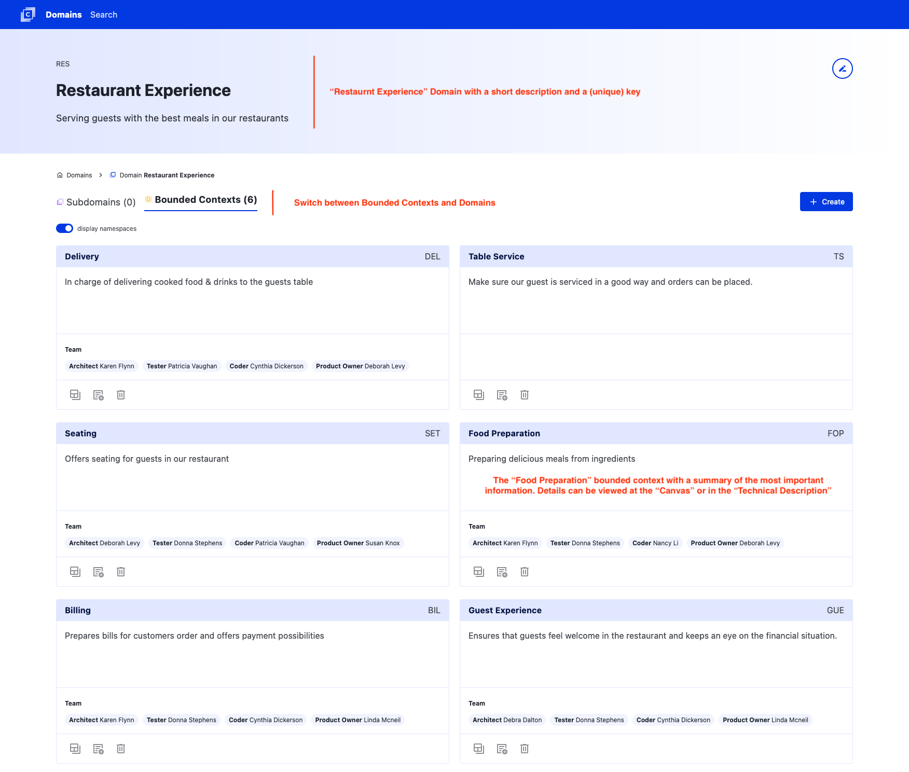

# Contexture - the Bounded Context Canvas Wizard

The Bounded-Context-Canvas (BCC) was introduced by [Nick Tune](https://medium.com/nick-tune-tech-strategy-blog/bounded-context-canvas-v2-simplifications-and-additions-229ed35f825f) as a tool to document and visualize contexts and their connections in a system.
The canvas can be used to certain document business aspects, the most important behaviors and interactions of a bounded context with other parts of the system.
Reading and understanding an existing canvas is simple, even for people who are not familiar with concepts from Domain Driven Design.
In order to create a new BCC, you need to understand a lot of concepts from DDD and filling in all the fields is not a simple task.

While other ways to build a [BCC exist](https://github.com/ddd-crew/bounded-context-canvas), we are building an application to support this modeling process with a dedicated tool developed with an DDD mindset.
You can read about the ideas of Contexture in the [concept](./concept.md) and you can view the current status of the application at <https://contexture.azurewebsites.net/> (be careful: don't store any sensitive data there; everything you store will be deleted upon the next deployment.)

Note:

We think that most of the domain modelling should happen in a collaborative way, by using whitepaper, Post-ITs or online collaboration tools.
Contexture is and will not be the right tool or a replacement for these interactive modelling sessions!
But Contexture might be useful to capture, document and structure some of the insights *after* a modelling session and make them accessible and shareable with other people!

## Example

Imagine you work with a company that owns a restaurant chain which cares about giving the guest a great experience.
The restaurants are equipped with different IT systems, which support the staff to execute their tasks.
The example can be seen at <https://contexture.azurewebsites.net/> and the following screenshots give a short summary / explanation

Domains of the example


An overview on the Bounded Contexts of the "Restaurant Experience" domain


A detailed view of the "Billing" Bounded Context with the help of the Bounded-Context-Canvas-v3


## Contexture server backend

The Contexture server implements a simple storage backend that uses `json-server` to expose a file system backed REST API and serving static assets through express.

### Installation

```bash
cd server
npm i
```

### Run the backend

```bash
cd server
npm start
```

Contexture server will listen on port 3000 per default. If you want to have the server listening on any other port set the environment variable `PORT` to the desired port.

### Caveats

- `cors` is configured to allow all origins
- no logging built in

## Contexture frontend application

The application is developed with [Elm](https://elm-lang.org/) and connects to the backend via the API.

Make sure [Elm](https://guide.elm-lang.org/install/elm.html) is installed and part of your path.

### Run the frontend

During development use `elm-live` for handling routes correctly.

```bash
npm install elm elm-live -g
cd app
elm-live src/Main.elm --pushstate
```

Building the app

```bash
cd app
elm make src/Main.elm
```

Make sure the backend part is reachable with its default url <http://localhost:3000>

## Running with Docker

```bash
cd app
elm make src/Main.elm --output=../server/public/index.html

cd ../server
docker build -t contexture .

docker volume create contexture_data
docker run -p 8081:3000 -v contexture_data:/data contexture
```

Now head to your browser and access the Contexture through http://localhost:8081

## Contributors

Thanks to all [existing and future contributors](https://github.com/Softwarepark/Contexture/graphs/contributors) and to the following individuals who have contributed with ideas, feedback or testing:

- [Nick Tune](https://github.com/NTCoding)
- Peter Rosner
